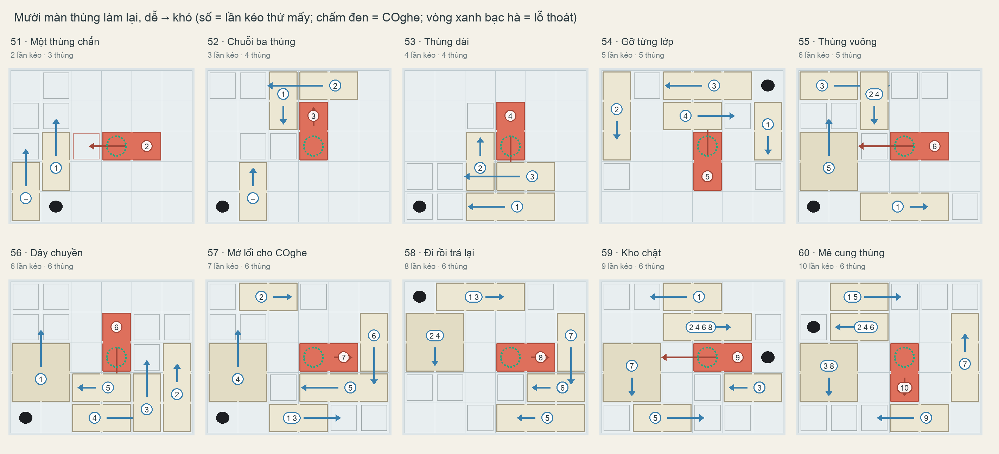

# Mười màn thùng làm lại cho đúng logic (51–60)

Mrk (06/10/2026), xem màn 52 của bộ cũ: "về mặt hiển thị chỉ cần kéo miếng màu đỏ xuống phía dưới là xong. Tại sao phải đẩy
xong mới đẩy miếng đó. Mày phải sửa lại những màn kiểu này cho có tính logic".

Bản này thay mười thiết kế trong [COGHE_CRATE_LEVELS_10.md](COGHE_CRATE_LEVELS_10.md). Mrk duyệt (06/10/2026): "Ok vậy mày triển khai levels 51-60 theo phương án này".

## Vì sao bộ cũ trông vô lý

Bộ cũ có một luật không nhìn thấy được: muốn đẩy thùng, COghe phải có một ô trống ngay sau thùng; muốn kéo, phải có ô trống
ngay sau chỗ thùng dừng. Một thùng có đường trượt trống vẫn có thể "không kéo được". Kiểm lại: cả mười màn cũ, ngay từ đầu,
đều có thùng trượt được mà không kéo được; ở 51–54 đó chính là thùng đỏ. Nếu chỉ tính thùng chắn đường nhau thì cả mười màn cũ giải được trong 1–3 lần kéo, trong
khi lời giải thiết kế cần 2–15 lần.

## Luật mới (`Tools/crate_puzzles/logic.py`)

Kiểm trên mọi thế bày người chơi có thể tới, không chỉ trên lời giải:

1. Thùng nào có đường trượt trống thì có chỗ cho COghe đứng đẩy hoặc kéo (mặt thùng rộng hai ô cần cả hai ô). Chỉ thùng chắn
   đường mới giữ một thùng lại.
2. COghe chỉ đi trên sàn, không trèo qua thùng. Thùng cao hơn COghe để nhìn là biết. COghe bị thùng vây thì thấy ngay trên màn.
3. Thùng đỏ lúc đầu bị thùng khác chắn đường trượt (ý gốc của Mrk). Lần kéo thùng đỏ là lần kéo cuối.
4. Không có thế bày nào bị kẹt: kéo sai luôn kéo lại được.

## Mười màn

"Do chắn" là số lần kéo cần nếu COghe đi được khắp nơi: phần độ khó đến từ thùng chắn nhau. Phần còn lại đến từ việc phải mở
lối cho COghe.

| Màn | Tên | Lần kéo | Thùng | Kéo lại | Do chắn | Ý |
|-----|-----|---------|-------|---------|---------|---|
| 51 | Một thùng chắn | 2 | 3 | 0 | 2 | Thùng đỏ trượt được, nhưng một thùng đứng ngay trên đường trượt |
| 52 | Chuỗi ba thùng | 3 | 4 | 0 | 3 | Thùng chắn thùng đỏ lại bị thùng khác chắn: gỡ từ ngoài vào |
| 53 | Thùng dài | 4 | 4 | 0 | 4 | Thùng dài 3 ô cần một khoảng trống dài |
| 54 | Gỡ từng lớp | 5 | 5 | 0 | 5 | Năm thùng chắn nhau thành chuỗi |
| 55 | Thùng vuông | 6 | 5 | 1 | 5 | Thùng vuông lớn; một thùng dời đi rồi trả về |
| 56 | Dây chuyền | 6 | 6 | 0 | 6 | Sáu thùng chắn nhau thành một chuỗi |
| 57 | Mở lối cho COghe | 7 | 6 | 1 | 5 | COghe bị thùng vây trong góc: mở lối cho nó trước |
| 58 | Đi rồi trả lại | 8 | 6 | 2 | 4 | Hai thùng dời tạm rồi trả về |
| 59 | Kho chật | 9 | 6 | 3 | 4 | Một thùng dời qua lại ba lần |
| 60 | Mê cung thùng | 10 | 6 | 4 | 3 | Bài cuối của bộ |

Từng màn: `crate-levels-logic/K01.png` … `K10.png`. Dữ liệu chính xác (thùng, điểm dừng, chỗ COghe bắt đầu, từng lần kéo đẩy
hay kéo và ô đứng): `crate-levels-logic/summary_logic.json`.

## Đổi so với bộ cũ

- Khó nhất 10 lần kéo, không phải 15. Sàn 6 × 5 ô mà COghe phải đi được: thêm thùng thì COghe bị cắt đường nhiều hơn. Với
  bảy, tám thùng, bộ tìm chỉ ra bài tối đa 7–8 lần kéo; bài sâu nhất (10 lần) có 6 thùng. Muốn khó hơn thì phải tăng sàn,
  ví dụ 7 × 6 ô, và hộp kính to hơn.
- Ở 51–56, gần như toàn bộ thứ tự kéo đến từ thùng chắn nhau. Ở 57–60, một phần đến từ việc mở lối cho COghe.

## Đã dựng trong Unity (06/10/2026)

Code: `Assets/_Game/Editor/COgheSpatialCrateLevels.cs` (dựng cảnh), `COgheSpatialCrateDesigns.cs` và
`Venom/Runtime/ChapterProof/COgheCrateRoutes.cs` (sinh bằng `Tools/crate_puzzles/export_unity.py` từ `summary_logic.json`).

- Ô 14 cm, không phải 12 cm. Lối đi rộng một ô giữa hai thùng cao phải đủ cho COghe (~11 cm) chui qua; 12 cm thì kẹt. Hộp
  kính 84 × 70 cm, vách kính đứng đúng mép lưới (dải sàn hẹp ngoài lưới khiến đường đi chui vào chỗ COghe không lọt). Camera tự
  canh khung theo hộp.
- Thùng cao 6 cm (thùng vuông 7 cm), cách mép ô 1 mm (hai thùng cạnh nhau cách 2 mm, không có đường đi lọt khe), nổi 2 mm trên
  sàn: đáy sát sàn thì vấp vành lỗ thoát khi trượt qua (thùng đỏ màn 59).
- Mặt thùng là mặt trơn (`Slippery`): COghe không bám để trèo, đường đi luôn vòng trên sàn khi có lối. Theo quy ước màu của game,
  mặt trơn có màu tím nhạt; thùng đỏ vẫn đỏ.
- `COgheTapRail.SeatAtStops` (mới, chỉ màn thùng bật): hết lần kéo, thùng được đặt đúng điểm dừng. Lực kéo nhả khi thùng vào
  vùng bắt (6 mm), thùng thường dừng thiếu vài mm và cấn thùng bên cạnh.
- COghe bắt đầu ở ô `spawn`; lời giải mẫu đi tới ô đứng của từng lần kéo, chạm thùng; thùng trượt, COghe đi theo hoặc lùi lại.

Kiểm tra: 10 test giải + 10 test đi lang thang (`SpatialPlusK01…K10Solve/Wander`) qua, hai lượt liên tiếp. Clip cả 10 màn:
`Artifacts/Clips/crates2/crates-51-60.mp4` (tốc độ x2).

Tìm lại: `python3 logic.py <levels> <seed from> <seed to> [append]` (biến `LOGIC_OUT` chọn file kết quả). Vẽ bảng:
`uv run --with pillow python3 levels_logic.py`.

## Điều khiển: chạm vào mặt khối (07/10/2026)

Mrk (07/10/2026): "Khi click vào khối cũng không thấy đẩy hoặc kéo. Khi click vào mặt khối, COghe phải đẩy hoặc kéo (trừ
khi bị kịch đường). Ví dụ lần thứ nhất đẩy thì lần thứ hai kéo, cho đến khi bị kịch đường."

Trước đây chỉ phần nóc khối nhận chạm, còn mặt bên thì không. Đầu mà COghe làm việc phụ thuộc vào chỗ COghe đang đứng, nên
người chơi phải tự dẫn COghe ra đúng ô rồi mới chạm vào khối. Giờ (`COgheTapRail.CrateFaces`):

- **Mặt nào cũng nhận chạm:** nóc và các mặt bên đều được. Chạm vào khối không bao giờ làm COghe đi lên khối.
- **Chạm một đầu khối** (mặt đầu, hoặc nóc/mặt bên ở một phần tư sát đầu): COghe tự tới đầu đó.
  - Khối chạy ra xa đầu đó: COghe đẩy.
  - Khối chạy về phía đầu đó: COghe kéo, lùi theo.
  - Chạm cùng một đầu hai lần thì lần đầu đẩy, lần sau kéo về. Nếu đầu đó không có chỗ đứng, COghe vòng sang đầu kia.
- **Chạm giữa khối:** đẩy nếu được, không thì kéo.
- **Bị chắn:** trước khi COghe đi, game kiểm luật như trong thiết kế:
  - các ô khối trượt qua phải trống;
  - ô COghe cần phải trống (sau mặt khối nếu đẩy, ngay sau điểm dừng nếu kéo).
  Không được thì khối đứng yên, COghe không đi, và game báo "Something is in the way" ngay lập tức. Trước đây COghe gồng 5 giây
  rồi mới báo.

Kiểm tra:
- Lời giải mẫu của cả 10 màn giờ chơi bằng chạm vào mặt khối, không dẫn COghe đi trước. Test giải và test đi lang thang của
  cả 10 màn đều qua.
- `COgheCrateTapTests` kiểm hai điều:
  - chạm mặt bên thì khối trượt; cùng một đầu chạm hai lần thì đẩy rồi kéo;
  - khối đỏ bị chắn thì bị từ chối ngay, không nhúc nhích, COghe không đi.
- Clip review: `OUTBOX/COGHE_CRATE_TAPS_2026_10_07/` (màn 6 và 20; quay bằng test `RecordCrateTapDemo`).

## Bám mọi mặt thùng, thùng cao hơn (08/10/2026)

Mrk (08/10/2026) thử cho COghe trèo lên thùng rồi bỏ: "Rollback lại code cũ đi, tao thấy phương án trèo lên hộp như này không
Ok. Tuy nhiên mày phải cho thùng cao lên và thể hiện rõ ràng là COghe không thể trèo được. Có 1 điểm nữa là lúc đẩy và kéo
thùng, phải cho COghe mặt nào cũng đẩy bám được, cho thật hơn, chứ ko phải đi ra 1 mặt như hiện tại. Phải tính toán để cách
này không ảnh hưởng tới độ khó levels hiện tại."

Phần trèo chưa từng được commit. Code đã về commit 173cc295, và bản vá được giữ ngoài repo.

**Luật mới.** COghe bám được mọi mặt thùng, có ba cách làm:
- đẩy từ sau;
- kéo từ trước;
- bám một mặt dài rồi đi dọc theo thùng. Cách này cần dải ô cạnh cả đường trượt ở mặt đó trống trên sàn, vì COghe đi theo
  thùng.

COghe vẫn chỉ đi trên sàn, không trèo. Trong bộ tìm: `LOGIC_SIDES=1`.

**Độ khó.** `check_sides.py` so số lần kéo ít nhất của 10 màn khi chỉ bám đầu thùng (như cũ) và khi bám được mọi mặt:

| Màn (vị trí) | Chỉ bám đầu | Bám mọi mặt |
| --- | --- | --- |
| K01–K08 (6, 10, 18, 20, 31, 34, 42, 46) | 2, 3, 4, 5, 6, 6, 7, 8 | không đổi |
| K09 (54), bài cũ | 9 | 6 |
| K10 (59), bài cũ | 10 | 7 |

Vì vậy K09 và K10 được tìm lại theo luật mới (`logic.py 31,33`, kết quả trong `cand_sides.json`). Hai bài mới vẫn 9 và 10
lần kéo, vẫn 6 thùng, và vẫn có thùng phải dời đi rồi trả về:
- K09 · Kho chật: một thùng dời qua lại bốn lần, 49 thế bày;
- K10 · Mê cung thùng: 76 thế bày.

8 màn đầu giữ nguyên bố cục và chỗ COghe bắt đầu. Lời giải mẫu giờ dùng cả cách bám mặt bên.

**Trong Unity:**
- **Thùng cao 10 cm** (thùng vuông 11 cm), gấp đôi COghe. Mọi mặt đều trơn và tô tím nhạt, nên nhìn là biết không trèo được.
- **Tay nắm ở hai đầu thùng không còn được vẽ**, vì giờ mặt nào cũng bám được.
- **`COgheTapRail.CrateFaces`:** chạm vào mặt nào thì COghe làm từ mặt đó. Nếu chạm lên nóc, mặt được chọn là mặt mà chỗ chạm
  nằm gần mép (40% ngoài cùng). Chạm giữa nóc thì COghe chọn mặt gần nó nhất mà làm được. Mặt đã chọn không có chỗ thì
  COghe thử mặt gần kế tiếp.
- **Bám mặt bên:** điểm bám ở giữa mặt dài, chỗ đứng cách mặt đó 6,2 cm. COghe đi dọc theo thùng trong lúc thùng trượt.
  `SideFree` kiểm dải ô cạnh cả đường trượt, `CanWorkAcross` và `WorkingAcross` dùng cho test.
- **Lời giải mẫu** chạm lên nóc thùng, gần mép của mặt có ô đứng trên tuyến: đầu thùng hoặc mặt bên.
- **Test mới** `ACrateTakenByALongSideSlidesWithCOgheBesideIt`: chạm gần mép dài, COghe bám đúng mặt đó, thùng trượt, và COghe
  đứng cạnh thùng ở mặt đó.

