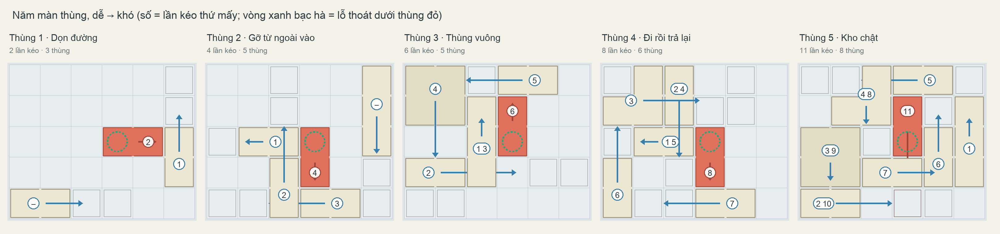
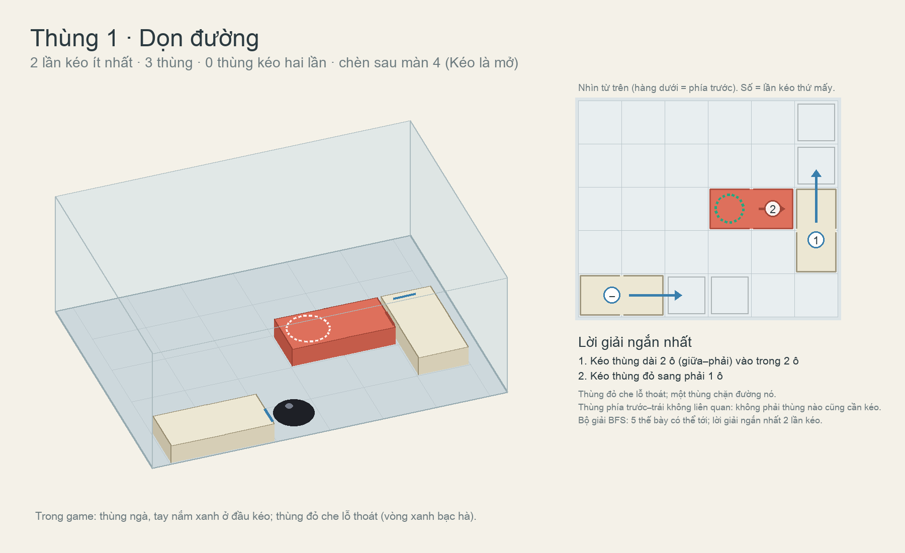
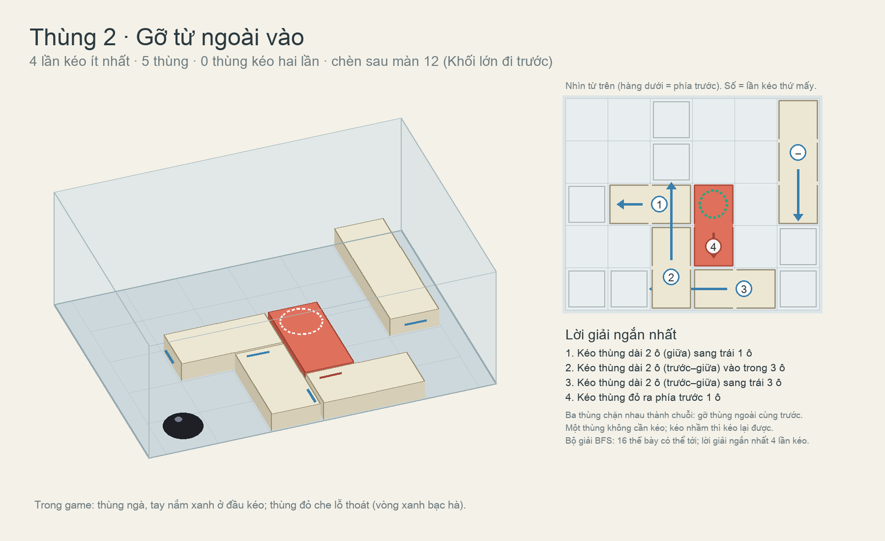
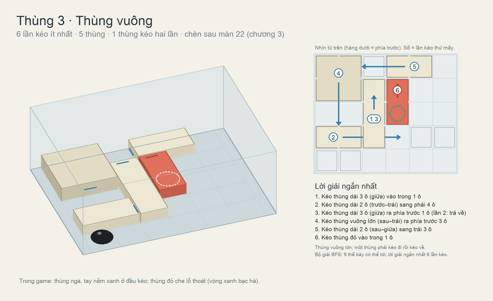
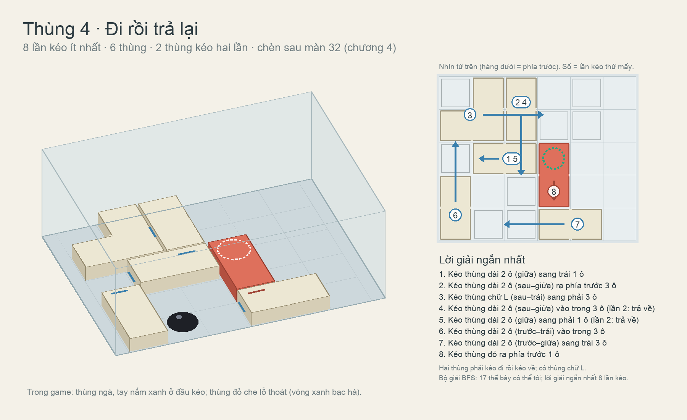
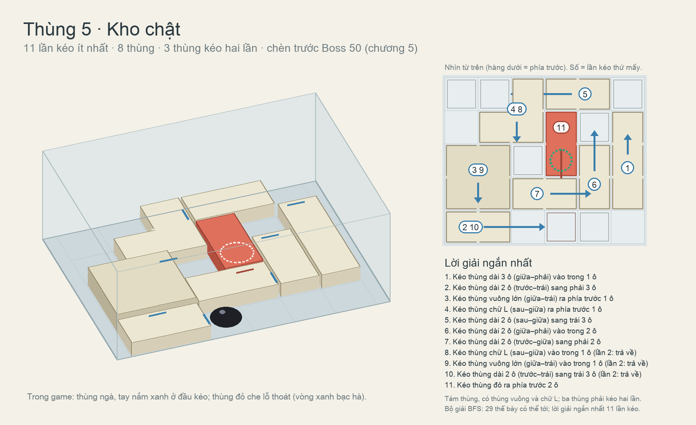

# Màn thùng: kéo thùng theo thứ tự để mở lỗ thoát (đề xuất, 06/10/2026)

Mrk (06/10/2026): thêm màn đẩy/kéo thùng, dễ → khó. Một thùng khác màu che lỗ thoát trên sàn và bị các thùng khác chặn;
COghe kéo các thùng có hình dạng, kích thước khác nhau theo thứ tự trước sau; việc cuối là kéo thùng khác màu ra khỏi
lỗ để thoát. Cần minh hoạ 5 màn để chèn xen kẽ vào các màn hiện có.

## Luật chơi

- Lưới 6 × 5 ô, mỗi ô 12 cm, nằm trong hộp 80 × 60 cm. Lỗ thoát là lỗ trên sàn (kiểu cửa sập của màn 7), vòng xanh bạc
  hà, ban đầu bị **thùng đỏ** che.
- Mỗi thùng chạy trên một ray riêng, chỉ trượt theo một hướng, giữa hai điểm dừng. Một lần chạm tay nắm = một lần kéo
  sang điểm dừng kia; kéo lần nữa thì về chỗ cũ. Thùng chặn nhau: thùng chỉ trượt được khi cả đoạn đường trống.
- Hình dạng: thùng dài 2 ô, dài 3 ô, thùng vuông lớn 2 × 2 (cao hơn), thùng chữ L. Thùng ngà; chỉ thùng đỏ khác màu.
- Kéo sai thì kéo lại được, không bao giờ kẹt, nên không cần Retry. Có thể thêm bộ đếm lần kéo và "chuẩn" (số lần kéo
  ít nhất ở dưới) để chấm sao: cái móc cho người chơi muốn giải gọn.

Mỗi màn đã kiểm tra bằng chương trình giải (BFS): giải được, số lần kéo ít nhất, và số thế bày người chơi có thể tạo ra
(càng nhiều càng có nhiều lựa chọn, nhiều đường đi sai). Công cụ: `Tools/crate_puzzles/`.

| Màn | Kéo ít nhất | Thùng | Kéo hai lần | Thế bày | Ý mới | Đề xuất chèn |
| --- | --- | --- | --- | --- | --- | --- |
| Thùng 1 · Dọn đường | 2 | 3 | 0 | 5 | Thùng đỏ che lỗ; một thùng chặn nó; một thùng không liên quan | sau màn 4 |
| Thùng 2 · Gỡ từ ngoài vào | 4 | 5 | 0 | 16 | Chuỗi chặn: gỡ thùng ngoài cùng trước | sau màn 12 |
| Thùng 3 · Thùng vuông | 6 | 5 | 1 | 9 | Thùng vuông lớn; kéo một thùng đi rồi kéo về | sau màn 22 |
| Thùng 4 · Đi rồi trả lại | 8 | 6 | 2 | 17 | Thùng chữ L; hai thùng đi rồi về | sau màn 32 |
| Thùng 5 · Kho chật | 11 | 8 | 3 | 29 | Tám thùng, vuông + chữ L | trước Boss 50 |

Chèn mỗi chương một màn như màn "nghỉ mà phải nghĩ", tổng 55 màn; hoặc thay các màn yếu nếu muốn giữ 50.

## Từng màn

### Thùng 1 · Dọn đường (2 lần kéo)

### Thùng 2 · Gỡ từ ngoài vào (4 lần kéo)

### Thùng 3 · Thùng vuông (6 lần kéo)

### Thùng 4 · Đi rồi trả lại (8 lần kéo)

### Thùng 5 · Kho chật (11 lần kéo)

## Khi dựng trong game

- Mỗi thùng là một `NextCrate` (ray hai điểm dừng, `LatchAtStart/End`); vị trí, hình, hướng, điểm dừng lấy đúng từ
  `crate-puzzles/summary.json`. Lỗ thoát: `c.Outward = Vector3.down` như màn 7.
- Tay nắm đặt ở đầu thùng phía nó sẽ trượt tới; COghe đứng ở phía đó và lùi dần khi kéo. Nếu điểm dừng sát kính, đặt
  tay nắm ở đầu kia để COghe đẩy.
- Thùng cao 4,5 cm, mặt ngà leo được, nên COghe trèo qua thùng để tới tay nắm; thùng vuông 6 cm. Thùng đỏ không cần
  nặng: nó chỉ là thùng cuối cùng.
- Không chữ trên thùng (quy tắc chương 1). Sơ đồ trong tài liệu đánh số thứ tự kéo chỉ để minh hoạ.
- Mỗi màn: lời giải mẫu theo đúng thứ tự trong bảng, test giải, test đi lang thang tìm chỗ kẹt.
