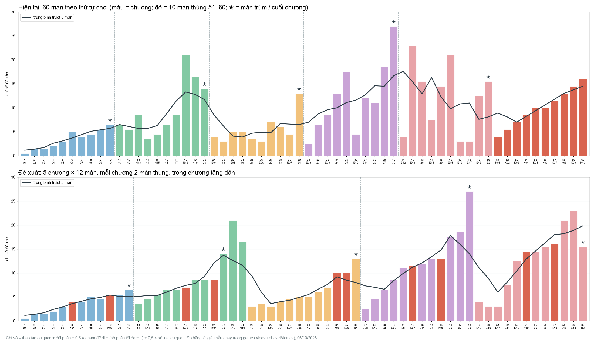
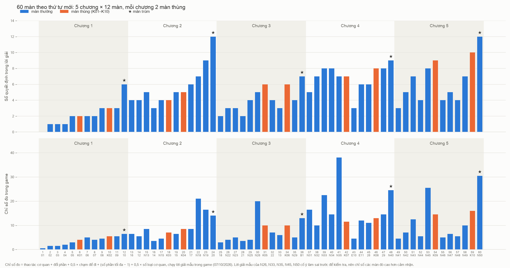

# Độ khó 60 màn và đề xuất sắp xếp lại

Mrk (06/10/2026): "vẽ biểu đồ độ khó hiện tại của 60 màn và đưa ra những đề xuất sắp xếp lại levels". Đây là đề xuất,
`SpatialOrder` chưa đổi.

## Đo thế nào

Test Explicit `MeasureLevelMetrics` (`Assets/_Game/Tests/PlayMode/COgheLevelMetrics.cs`) chạy lời giải mẫu của từng vị trí
1–60 ngay trong game và ghi lại:

- số lần chạm;
- số lần chạm do cơ quan nhận (`VenomCampaign.MechanismTaps`: kéo tay nắm, bấm, chia Q…);
- số lần đổi phần (`PartSelections`);
- số giây mô phỏng tới lúc thoát;
- số phần nhiều nhất cùng lúc;
- độ xoay camera;
- các loại cơ quan trong hộp.

Số liệu: `difficulty-60/levels.jsonl`. Biểu đồ: `Tools/level_metrics/chart.py`.

**Chỉ số độ khó** = thao tác cơ quan + đổi phần + 0,5 × số lần chạm để đi + (số phần tối đa − 1) + 0,5 × số loại cơ quan
(tay nắm, máy Q, ống, thang, dây đu, bập bênh, bánh răng, khoá cân, bàn xoay, ròng rọc, thùng rời).

Đây là ước lượng, trọng số do tao chọn. Có ba điểm cần biết khi đọc:

- Lời giải mẫu có vài lần chạm "cho chắc" (đi từng chặng), nên số lần chạm để đi hơi cao hơn số người chơi cần.
- Màn chơi bằng cảm giác vật lý (bập bênh, bánh răng quay khi đi) ít thao tác, nên chỉ số thấp hơn cảm nhận.
- Chưa tính phần khó "nhìn ra" (aha) và độ chính xác (canh thời điểm).

## Hiện tại

| Chương | Vị trí | Độ khó | Nhận xét |
|--------|--------|--------|----------|
| 1 | 1–10 | 0,5 → 6,5 | Lên đều, êm. |
| 2 | 11–20 | 3,5 → 21 | Vọt lên ở 18 *Nửa thân không đủ sức* (21), khó nhất nửa đầu game. 18, 19, 20 đều khó hơn mọi màn của chương 3. |
| 3 | 21–30 | 3 → 7, trùm B1 13 | Chín màn liền ở mức 3–7, rơi hẳn so với cuối chương 2. |
| 4 | 31–40 | 2,5 → 27 | Lên tốt, nhưng 36 *Đu rồi luồn* (4,5) rơi ngay sau 35 (17,5). 40 *Hộp cộng hưởng* (27) khó nhất game. |
| 5 | 41–50 | 3 → 23, trùm B2 15,5 | 42 *Hai ống, hai nửa* (23) là màn thứ hai của chương. 47, 48 (3) dễ nhất chương mà nằm ngay trước đoạn cuối. Trùm B2 dễ hơn 42 và 46. |
| Thùng | 51–60 | 4 → 16 | Lên đều nhưng dồn một cục sau trùm cuối: game kết thúc bằng màn dễ hơn đỉnh chương 4–5. |

Chỉ hai màn cần xoay camera: 3 *Nhìn quanh vách* và 10 *Cỗ máy thân quen*.

## Đề xuất: 5 chương × 12 màn

Mỗi chương xen 2 màn thùng, trong chương tăng dần.

Luật sắp:

1. Giữ chương theo chủ đề.
2. Màn giới thiệu cơ quan vẫn đứng trước các màn dùng nó.
3. Giữ các cặp phụ thuộc: 18 → 19 (19 là bố cục lật ngược của 18); 33 → 34 → 35.
4. Các màn còn lại xếp tăng dần theo chỉ số.
5. Màn thùng 51–60 chia đôi cho từng chương, đặt ở chỗ độ khó vừa (thùng 1 sau khi đã học kéo tay nắm ở màn 4).
6. Màn trùm, màn cuối chương vẫn đứng cuối.

| Chương | Thứ tự mới (mã · tên · chỉ số) |
|--------|---------------------------------|
| 1 | 01 · 02 · 03 · 04 · 05 · **K01** · 07 · 06 · 08 · **K02** · 09 · 10★ |
| 2 | 14 · N15 · 12 · 16 (máy Q) · 15 · **K03** · N13 · 17 · **K04** · 20 · N18 · N19 |
| 3 | 18 (dây đu) · 21 (bập bênh) · E06 · E04 · E07 · E05 · 19 · 13 · 22 · **K05** · **K06** · B1★ |
| 4 | E08 · E10 · 23 · E09 · 26 · **K07** · E11 · 24 · **K08** · 25 · 27 · 30★ |
| 5 | E12 · E16 · E17 · E14 · E18 · **K09** · 29 · 28 · **K10** · E15 · E13 · B2★ |

(Mã là mã nội dung, xem biểu đồ dưới để thấy vị trí mới và độ khó.)

Còn hai chỗ chưa ổn, cần Mrk chọn:

- **Chương 2 kết bằng N18 (21) rồi N19 (16,5).** N19 phải đứng sau N18. Muốn chương lên đều thì làm dễ N18 bớt. Phần lớn độ khó
  của nó đến từ đổi phần: 7 lần đổi, 26 lần chạm.
- **Trùm B2 (15,5) dễ hơn E13 (23) và E15 (21).** Có hai cách: chuyển E13 *Hai ống, hai nửa* sang chương 4 (nó là bài ống + Q, đúng
  chủ đề chương 4), hoặc làm B2 khó lên.

## Làm thật thì phải đổi gì

- `SpatialOrder` (`COgheSpatialCampaignBuilder.cs`).
- `ApplySpatialOrder` + đánh lại số trên bảng (`RenumberSpatialPlaques`), dựng lại danh mục (`COgheProductUIBuilder.Prepare`).
- Kiểm chỗ nào gắn với vị trí cũ (mở nhà sau màn 10, giới thiệu trùm). Tiến độ đã lưu theo mã màn, không theo vị trí.
- Chạy lại `MeasureLevelMetrics` để vẽ đường mới bằng số đo thật.

## Đã áp dụng (07/10/2026)

Sau khi dựng lại chương 3–5, thứ tự 60 màn đã đổi trong `SpatialOrder`: 5 chương × 12 màn, mỗi chương 2 màn thùng, Boss vẫn
đứng cuối chương.

| Chương | Thứ tự (mã nội dung) |
|--------|-----------------------|
| 1 | 01 · 02 · 03 · 04 · 05 · **K01** · 06 · 07 · 08 · **K02** · 09 · 10★ |
| 2 | 16 · 12 · N13 · 14 · N15 · **K03** · 15 · **K04** · 17 · N18 · N19 · 20★ |
| 3 | 18 · N22 · N23 · 21 · N25 · N26 · **K05** · 22 · 13 · **K06** · N29 · B1★ |
| 4 | N31 · N32 · N33 · N34 · N35 · **K07** · E10 · E11 · 26 · **K08** · 29 · N40★ |
| 5 | N41 · N42 · N43 · N44 · N45 · **K09** · N46 · N47 · N48 · N49 · **K10** · N50★ |

Cách xếp:
- Mỗi chương giữ đường đã thiết kế theo kế hoạch móc câu (dạy, luyện, kết hợp, chuẩn bị Boss, Boss). Màn dạy cơ quan vẫn
  đứng trước các màn dùng nó.
- Màn thùng K01–K10 đi từ dễ tới khó và đặt vào chỗ có số quyết định khớp:
  - K01 sau 04–05, tức là sau khi đã học kéo tay nắm.
  - K07 đứng sau đỉnh N35, rồi tới màn nghỉ E10.
  - K09 đứng sau đỉnh N45, rồi tới màn nghỉ N46.
  - K10 đứng ngay trước Boss N50.
- Biểu đồ dùng số quyết định để xếp. Chỉ số đo trong game (`difficulty-60b/levels.jsonl`, `Tools/level_metrics/order60.py`)
  nhiễu ở các màn mà lời giải mẫu cố ý làm sai trước để kiểm tra (N26, N33, N35, N45, N50).

Còn gồ ghề:
- Chương 2: N18 và N19 khó hơn Boss 20 theo chỉ số đo.
- Chương 3: 22 và 13 chưa dựng lại theo kế hoạch (dự kiến 6 quyết định), nên hai màn thùng của chương 3 đang cao hơn màn đứng
  cạnh.
- Chương 4: E11, 26 và 29 chưa dựng lại.

Boss và việc mở Nhà đi theo cờ `Boss`, không theo vị trí. Tiến độ đã lưu theo mã màn. Bộ PlayMode đầy đủ chạy lại sau khi đổi
thứ tự.
