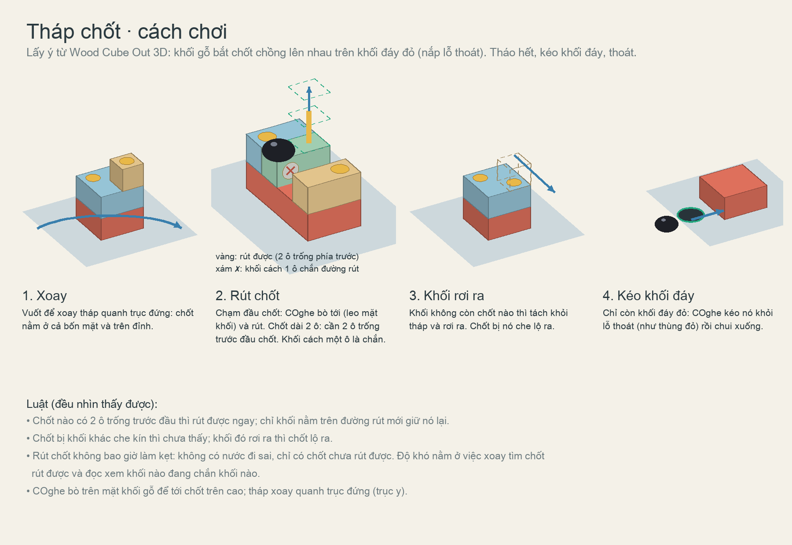
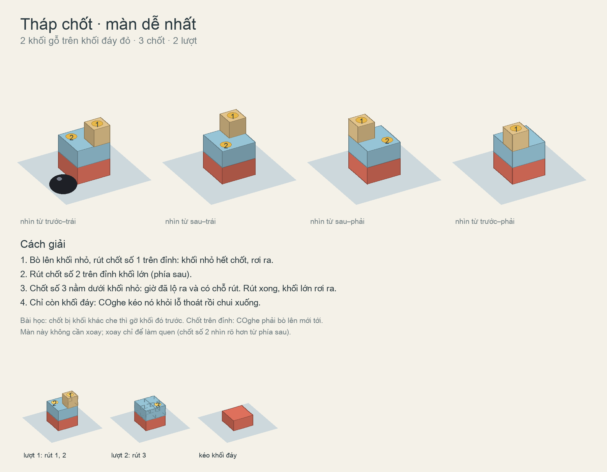
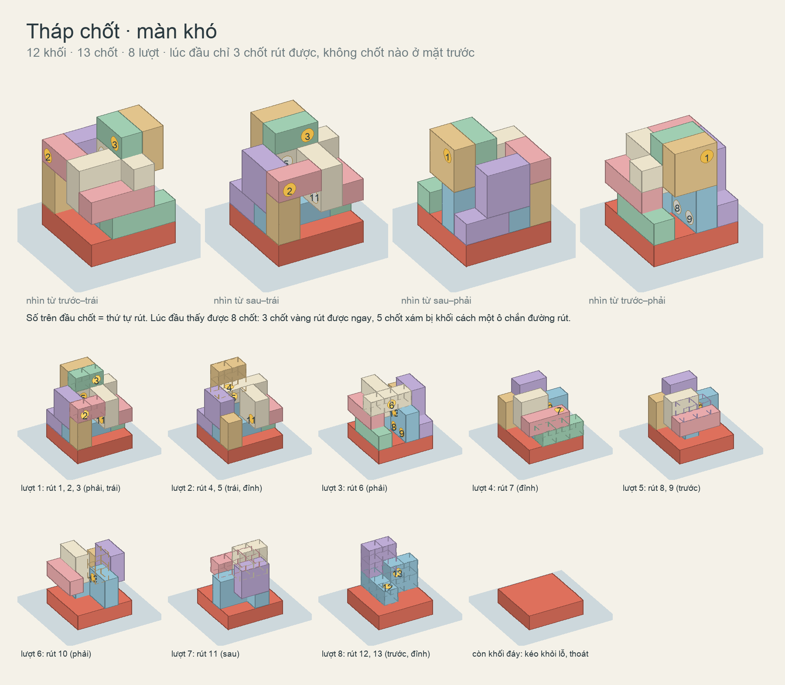

# Tháp chốt: dạng màn lấy ý từ Wood Cube Out 3D

> Đã loại (06/10/2026). Mrk: "loại bỏ 2 màn 61 -62. Cách chơi này không ok với gameplay hiện tại." Hai màn thử 61–62 và cơ
> chế `COghePinTower` đã gỡ khỏi game (danh mục còn 60 màn); bộ giải và công cụ vẽ (`Tools/pin_towers`) cũng đã xoá.
> Tài liệu này và các hình giữ lại để ghi nhận ý đã thử.

Mrk (06/10/2026): nghiên cứu Wood Cube Out 3D; "Sẽ có những khối xếp chồng lên nhau và bị gắn với nhau bởi các chốt, COghe
phải bò lên rút các chốt để các khối này tách ra để COghe sẽ kéo được khối cuối cùng trên sàn để thoát ra ngoài. Hướng chơi
game của mechanic này sẽ nằm theo trục y, user phải xoay xung quanh để xem tháo chốt nào trước chốt nào sau." Vẽ minh hoạ cách
chơi, một bài dễ nhất và một bài khó. Mrk (06/10/2026): "xây dựng 2 bài này để test (bài 61, 62)". Đã dựng thử, xem mục cuối.

## Trò tham khảo: Wood Cube Out 3D

Nguồn: [Google Play](https://play.google.com/store/apps/details?id=com.gplay.wood.cube.out), xem ngày 06/10/2026. Nhà phát
triển GPLAY JSC, 100K+ lượt tải, 4,1★ (230 đánh giá), cập nhật 23/12/2025. Ảnh màn hình trên trang và mô tả của trang cho thấy:

- Mỗi màn là một mô hình 3D (khủng long, robot, xe) ghép từ khối gỗ, bắt bằng vít nhiều màu.
- Người chơi xoay mô hình 360° quanh trục đứng.
- Chạm một vít thì vít bay vào hộp cùng màu ở trên (3 vít một hộp). Không có hộp hợp màu thì vít vào hàng 5 ô chờ; ô chờ đầy là
  kẹt ("avoid blockages").
- Khối hết vít thì rơi khỏi mô hình. Vít nằm dưới khối đó lộ ra.
- Có búa làm trợ giúp (đập vỡ).
- Mô tả của trang: "dismantle wooden blocks connected by screws in a 3D space ... remove the components in a logical way".

Phần lấy cho COghe: khối bắt chốt, xoay quanh trục đứng, khối hết chốt thì rơi ra, chốt bị che thì lộ ra sau. Phần không lấy:
chọn màu và ô chờ. Ở trò gốc, độ khó chủ yếu nằm ở đó. Với COghe, độ khó nằm ở thứ tự rút mà mắt thấy được (dưới đây).

## Luật cho COghe

Kiểm bằng một bộ giải (đã xoá cùng các màn):

1. Tháp gồm các khối gỗ chồng lên khối đáy đỏ. Khối đáy là nắp lỗ thoát, như thùng đỏ ở màn 51–60.
2. Chốt xuyên qua một khối vào khối nằm sau nó, đầu chốt lộ ở mặt bên hoặc mặt trên. Chạm đầu chốt thì COghe bò tới (leo mặt
   khối) và rút.
3. Chốt dài 2 ô. Rút được khi 2 ô trước đầu chốt đều trống. Khối nằm cách đầu chốt một ô thì chắn: thấy chốt nhưng chưa rút
   được (vẽ màu xám). Chỉ khối nằm trên đường rút mới giữ được chốt; không có luật ngầm.
4. Khối không còn chốt nào thì tách khỏi tháp và rơi ra. Chốt nó đang che lộ ra.
5. Khi chỉ còn khối đáy, COghe kéo nó khỏi lỗ rồi chui xuống.
6. Rút chốt không bao giờ làm kẹt: không có nước đi sai. Độ khó nằm ở việc xoay tìm chốt rút được và đọc xem khối nào chắn
   đường rút của chốt nào.

## Màn dễ nhất

Gồm 2 khối, 3 chốt, 2 lượt. Khối nhỏ che một chốt của khối lớn: rút chốt khối nhỏ, khối nhỏ rơi, chốt lộ ra.

## Màn khó

Gồm 12 khối trên khối đáy 4 × 4 ô, 13 chốt, 8 lượt.
- Lúc đầu thấy 8 chốt. Chỉ 3 chốt rút được, và không chốt nào ở mặt trước. 5 chốt kia bị khối cách một ô chắn.
- Chốt rải đều: trước 3, sau 1, trái 3, phải 3, đỉnh 3.
- Phải xoay sang mặt khác ở 7 lượt.

Bố cục do bộ tìm sinh ra (`towers.py`: leo đồi trên chỗ đặt chốt, ưu tiên chốt "thấy mà chưa rút được", độ sâu, chốt đầu tiên
không ở mặt trước). Hình còn rối; nếu Mrk duyệt hướng này thì vẽ lại tay cho gọn.

## Câu hỏi để duyệt

- Có cần lớp chọn màu và ô chờ như trò gốc không? Hiện bỏ, để mỗi lần rút chốt không phải chạy đi cất.
- Ô 9 cm thì COghe (~11 cm) không lọt khe một ô. Khi dựng trong game cần ô 12–14 cm như màn thùng, và hộp kính cao hơn (tháp
  4 tầng).
- Khối rơi ra: rơi xuống máng quanh đáy rồi biến mất, hay nằm lại trên sàn? Nằm lại thì có thể chắn đường COghe.

## Đã dựng thử trong Unity rồi gỡ (06/10/2026)

Màn 61 (dễ) và 62 (khó) được dựng với cơ chế mới `COghePinTower`: chạm chốt thì COghe bò tới rút; khối hết chốt thì rơi ra;
khối đáy bị khoá ray cho tới khi tháp hết khối. Lời giải mẫu chạy được cả hai màn và đã gửi clip cho Mrk. Mrk xem xong thì
loại: cách chơi này không hợp với gameplay hiện tại. Toàn bộ code và cảnh của 61–62 đã gỡ.
