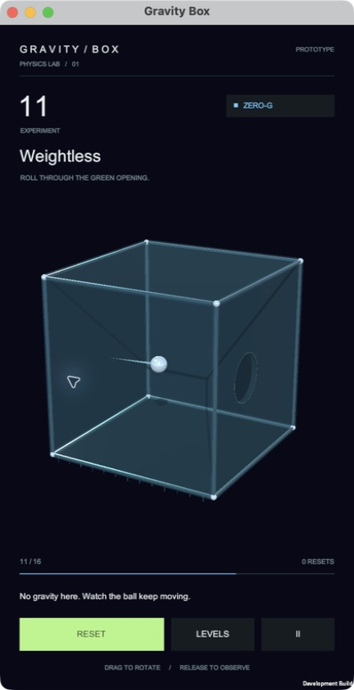
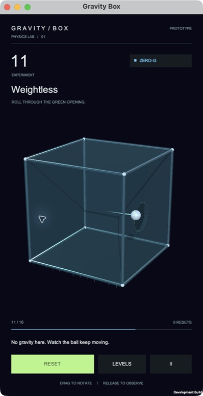

# Gravity Box

Prototype puzzle 3D bằng Unity: xoay hộp, để vật lý di chuyển quả bóng. 16 màn gồm 10 gravity và 6 zero-G, cơ cấu tái sử dụng và profile cấu hình bằng ScriptableObject.

## Chạy

1. Mở thư mục dự án bằng **Unity 6000.3.19f1**.
2. Mở `Assets/_Game/Scenes/Gameplay.unity` hoặc menu **Gravity Box → Open Gameplay**.
3. Chọn Game View portrait **9:16**, nhấn Play.

Kéo chuột trái hoặc một ngón tay trong vùng hộp để xoay. Thả để quan sát. **R** reset, **P/Esc** pause; nút LEVELS chọn màn. **D** bật diagnostics trong Editor/development build. Release player không bật diagnostics.

## Tài liệu

- [Triết lý thiết kế: vật lý và cơ chế nắp rơi](Docs/PHYSICS_DESIGN_PRINCIPLES.md)

- [Kế hoạch chi tiết và các cổng nghiệm thu](Docs/IMPLEMENTATION_PLAN.md)
- [Kiến trúc, lifecycle và sơ đồ phụ thuộc](Docs/ARCHITECTURE.md)
- [Quyết định kỹ thuật và tradeoff](Docs/DECISIONS.md)
- [Nhật ký phát triển và kết quả xác minh](Docs/DEVELOPMENT_LOG.md)
- [Đường giải đã kiểm chứng bằng PhysX](Docs/SOLVABILITY.md)
- [GDD gốc](Docs/GRAVITY_BOX_GDD.docx)
- [Nội dung GDD đã trích xuất](Docs/GDD_REFERENCE.md)

## Cấu trúc

```text
Assets/_Game/
  Scripts/Foundation/      State machine, reset contracts, không phụ thuộc Unity
  Scripts/Simulation/      Rigidbody, forces, environment, rotation
  Scripts/Gameplay/        Level lifecycle, signals, reusable mechanisms
  Scripts/Presentation/    Input System, HUD, camera, audio
  Scripts/App/             Composition root, local playtest CSV
  Editor/                  Baseline generation và build commands
  Prefabs/                 Ball, mechanisms, 16 levels
  ScriptableObjects/       Catalog, level definitions, environment/physics profiles
  Scenes/Gameplay.unity    Một scene cho toàn bộ phiên chơi
  Tests/                   Edit Mode và Play Mode
Docs/                      Thiết kế, kế hoạch, bằng chứng kiểm thử
Tools/                     CLI build và verification
```

## Tuning và thêm màn

Sửa sensitivity, smoothing, tốc độ xoay và assisted snap trong `ScriptableObjects/Physics/Rotation.asset`. Sửa gravity, damping, velocity caps trong `ScriptableObjects/Environments`. Bóng và collision profile ở `ScriptableObjects/Physics/Ball.asset`.

Duplicate prefab level và LevelDefinition, gán prefab/profile, stable ID duy nhất rồi thêm vào LevelCatalog. Cơ chế mới tuân theo [triết lý vật lý](Docs/PHYSICS_DESIGN_PRINCIPLES.md): vật thể/contact/khớp trực tiếp quyết định đường đi; có thể dùng prefab LooseLid và PhysicalProp làm điểm bắt đầu. Channel và RequiredChannel chỉ còn phục vụ các màn tín hiệu kế thừa. BallSpawn phải nằm trong hộp, cách mọi solid collider ít nhất bán kính ball. Giữ scale root = 1; ball và props tự do không nằm dưới root khi mô phỏng.

Menu **Generate Prototype Baseline** tái tạo asset baseline, có thể ghi đè chỉnh sửa trên các file baseline. Dùng Git/variant hoặc tạo asset riêng trước khi chạy lại. Project đã có sẵn prefab/scene nên không cần generate để chơi.

## Kiểm thử và build

Đóng Unity đang mở project trước khi chạy CLI:

```bash
bash Tools/verify.sh
bash Tools/build.sh macOS
bash Tools/build.sh Android
bash Tools/build.sh iOS
bash Tools/build.sh iOS-Simulator
```

Có thể đặt `UNITY_EDITOR` tới executable đúng phiên bản trên máy khác. Test XML/log vào `Artifacts/`, build vào `Builds/`; hai thư mục này không commit. Android cần SDK/NDK/JDK và module Android; iOS export cần module iOS, compile/cài thiết bị cần Xcode/signing.

Telemetry chỉ lưu local trong `Application.persistentDataPath/Playtests`. Không có network analytics, tài khoản hay dịch vụ bên ngoài. Xem DEVELOPMENT_LOG trước khi coi tính năng là đã nghiệm thu trên thiết bị thật.

Menu **Gravity Box → Validate Content** kiểm tra ID, prefab/profile, các kênh plate-door/exit và spawn không chồng collider. Mỗi build tự chạy validator. Test khả giải replay route đã lưu; chỉ đặt `GRAVITYBOX_RECORD_SOLUTIONS=1` khi chủ ý tạo/cập nhật bằng chứng đường giải.

Trong development player, **F12** lưu ảnh render gốc vào `Application.persistentDataPath/gravity-box.png`.

Để export, compile và cài lên iOS Simulator đang boot trên Apple Silicon: `bash Tools/run-ios-simulator.sh`. Có thể truyền UDID làm tham số đầu. Simulator dùng ARM64 và MSAA tắt để tránh mismatch render attachment của Metal; cấu hình device được phục hồi sau export.

## Ảnh từ bản chạy

Chuỗi ảnh native từ cùng một lần chơi màn L11 với lỗ tròn khoét phẳng:

| Bi trong hộp | Bi đang qua cửa, chưa thắng | Bi ngoài cửa, đã thắng |
| --- | --- | --- |
|  |  |  |

### Điều kiện thắng hiện tại

Lăn bi qua lỗ tròn khoét trực tiếp trên mặt hộp, với đường sáng xanh mảnh và dịu quanh mép. Mặt lăn phẳng, không có gờ cửa nhô lên. Chỉ khi toàn bộ bi ra ngoài mới thắng; chạm vào cửa chưa đủ. Bi tiếp tục rơi/bay theo vận tốc thực, cảnh giữ 1,8 giây ở slow motion trước khi chuyển màn. Màn có switch dùng shutter hổ phách khóa cửa cho đến khi kích hoạt đúng channel.

Chi tiết hợp đồng geometry/detector và quyết định thay thế GDD cũ: [ADR 011–012](Docs/DECISIONS.md). Khi chỉnh kích thước cửa phải chỉnh cả các tấm vỏ/viền tương ứng, rồi chạy Validate Content và bộ test vật lý.

### Level 6: nắp rơi theo trọng lực

Xoay để lỗ lên phía trên: nắp ở mặt trong sẽ rơi xuống trong hộp, để lỗ thông thoáng. Nghiêng để nắp dời sang bên, rồi đưa bi qua lỗ. Nắp vẫn là vật thể có khối lượng/va chạm và có thể bị đẩy hoặc rơi lại gần cửa. Màn này đã bỏ công tắc và cửa trượt theo tín hiệu; các màn cũ còn cơ chế tín hiệu đang được ghi riêng trong kế hoạch chuyển đổi.
